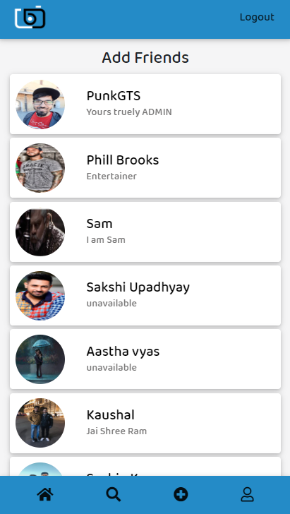

# Punk_gts-Social-Web-Application

## This web-based-application that supports information publishing and sharing (text, photo), the building of personal profiles, connecting to a community and searching within the community.

https://punk-gts-social-app.herokuapp.com/

### Registration for new User

### Login

### Provides Reset Password link to respective Email ID by sending mail using nodemailer

  
### Dashboard to see latest Posts of the users you follow.

### Provides functionalities such as Upvote , Downvote and Comment on any Post

### Allows user to edit and delete their comments

### Allows to edit your profile anywhere whether it is dashboard or your own profile page.

### See other Users' Profile and follow them to see their Latest posts

### Share your thoughts using Pictures and Texts

### Can visit your Own Profile

 
 
###  Update Profile at any time 
 
 
### Allows User to deactivate your account to hide your profile from the community

### Note: Also has Admin Feature provided to Author only .

## Author : Shorya Upadhayay

# Technology Used

- ReactJS with Redux For FrontEnd
- React-Bootstrap for designing
- NodeJS-ExpressJS For BackEnd
- Database Used Is MongoDB-Atlas
- JWT Token for Authentication
- CLoudinary for storing images
- NodeMailer for sending Mail
- Heroku for Deploying

============================Thank You====================================
